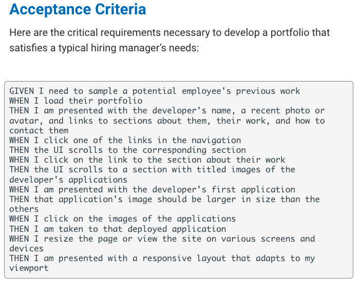

# Portfolio
Coding Bootcamp Project
## Description: 
This assignement is to build a portfolio in HTML and CSS to showcase skills in full stack web development. 
 

 ## User Story:
 
 

 ### Link to deployed page: https://gordonlc18.github.io/portfolio/

 # Contributor:
 Latravia Gordon © 2022 All Rights Reserved.